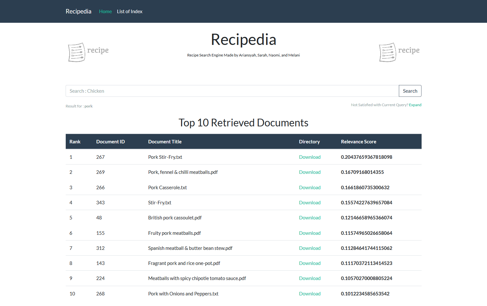

# Recipedia

> Search Engine about Recipes with Query Expansion using Pseudo Relevance Feedback

## Requirements

- Flask (`pip install flask`) is required for all the examples.
- Flask-WTF (`pip install flask-wtf`) is required for examples 5 and up.

## Running the Examples

1. `clone` the projects
2. `cd` into the projects folder and run the main script.

For example (Windows) :

    $ set FLASK_APP=app.py
    $ flask run

For example (MacOs) :

    $ export FLASK_APP=app.py
    $ flask run
